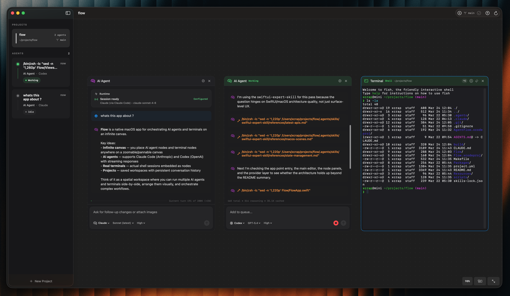

# Flow

A native macOS app for orchestrating AI agents and terminals on an infinite canvas. Built with Swift 6 and SwiftUI for macOS 26 (Tahoe).

  



## Features

- **Infinite Canvas** — Drag, zoom, pan. Place AI agents and terminals anywhere.
- **Claude Code Integration** — Chat with Claude via Claude Code CLI. Full tool use, streaming, session resume.
- **Codex (OpenAI) Integration** — GPT-5.4 via Codex app-server. Persistent threads, full context.
- **Terminal Nodes** — Real shell sessions on the canvas. Run commands, see output.
- **Folder-Based Projects** — Each project maps to a directory. Agents and terminals operate in that folder.
- **Full Persistence** — Projects, nodes, conversations, terminal history, canvas state all survive restarts.
- **Command Palette** — Cmd+K for quick actions.
- **Git Integration** — Branch display, commit, push from toolbar.
- **Code Blocks** — Syntax-highlighted code with copy button.

## Requirements

- macOS 26 (Tahoe) or later
- Xcode 16+ (for building)
- [XcodeGen](https://github.com/yonaskolb/XcodeGen) (`brew install xcodegen`)
- [Claude Code](https://claude.ai/code) CLI installed (`claude` in PATH)
- [Codex](https://openai.com/codex) CLI installed (`codex` in PATH) — optional, for OpenAI models

## Build & Run

```bash
make dev       # Build debug + open (dist/Flow-Dev.app)
make build     # Build release (dist/Flow.app)
make run       # Build release + open
make test      # Run all package tests
make clean     # Remove build artifacts
```

Debug builds use a separate bundle ID (`com.flow.app.dev`) and data directory, so developing won't interfere with your installed release version.

### From Xcode

```bash
xcodegen generate
open Flow.xcodeproj
# Cmd+R to build and run
```

## Quick Start

1. Build and run the app
2. Press **Cmd+N** to create a project (pick a folder)
3. Click **+** in toolbar to add an AI Agent or Terminal
4. Chat with Claude or run commands
5. Drag nodes by their title bar, resize from edges

## Tech Stack

- **SwiftUI** — All UI
- **Swift 6** — Strict concurrency
- **XcodeGen** — Project generation
- **Claude Code CLI** — AI agent backend
- **Codex CLI** — OpenAI agent backend (app-server JSON-RPC)

## License

MIT
